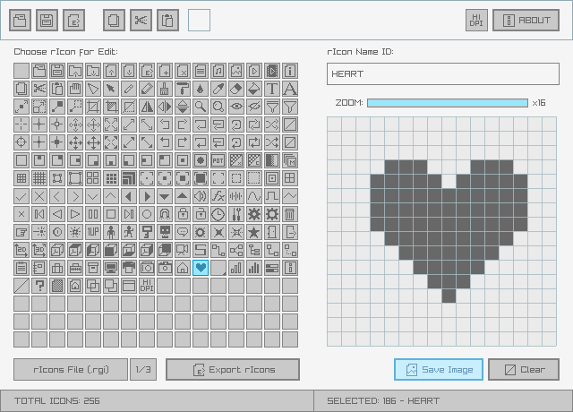

# rGuiIcons

A simple and easy-to-use [raygui](https://github.com/raysan5/raygui) icons editor.

Useful for tools icons customization. The best tool companion for [rGuiLayout](https://raylibtech.itch.io/rguilayout) and [rGuiStyler](https://github.com/raysan5/rguistyler).

rGuiIcons can be used for free as a [WebAssembly online tool](https://raylibtech.itch.io/rguiicons) and it can also be downloaded as a **standalone tool** for _Windows_ and _Linux_ with some extra features.

<br>

_NOTE: This tool is itended to be used with [**raygui 3.1**](https://github.com/raysan5/raygui)_

## rGuiIcons Features

 - **Icon preview** in real time while editing
 - **Cut, copy, paste** icons for easy editing
 - Save and load as binary icons file `.rgi`
 - Export icons as an embeddable **code file** (`.h`)
 - Export icons set and individual icons as a `.png`
 - Icon description exported as standard PNG chunks
 - **200 custom icons for reference** and basic edition
 
### rGuiStyler Standalone Additional Features

 - Command-line support for `.rgi`/`.h`/`.png` batch conversion
 - **Completely portable (single-file, no-dependencies)**

## rGuiIcons Screenshot



## rGuiIcons Usage

The tool is quite intuitive, the expected steps to follow are: 
 1. Choose the icon to edit from icons panel
 2. Edit the icon pixels in the right panel
 3. Select next icon for edit or export set/individual icon
 
NOTE: Icon changes are previewed in real time in the same tool! 

Once icons have been created/edited, they can be saved as a raygui-ready icon set (.rgi), exported as an embeddable `.h` **code file** or exported as a `.png` image. Note that the `.png` contains the icons ids information in a standard chunk (`tEXt`/`zTXt`).

 - raygui icon set file (`.rgi`) can be loaded by raygui using the function `GuiLoadIcons()`.

 - raygui icon set code file (`.h`) can be embedded into a raygui-based application just defining:

```c
#define RAYGUI_IMPLEMENTATION
#define RAYGUI_CUSTOM_ICONS     // Custom icons set required 
#include "gui_icons.h"          // Custom icons set provided, generated with rGuiIcons tool
#include "raygui.h"
```

`rGuiIcons Standalone` comes with command-line support for batch conversion. For usage help:

 > rguiicons.exe --help

## rGuiIcons License

`rGuiIcons` online tool can be used completely for free.

`rGuiIcons Standalone` desktop tool is distributed as freeware. 

In any case, consider some donation to help the author keep working on software for games development.

*Copyright (c) 2015-2022 raylib technologies ([@raylibtech](https://twitter.com/raylibtech))*
